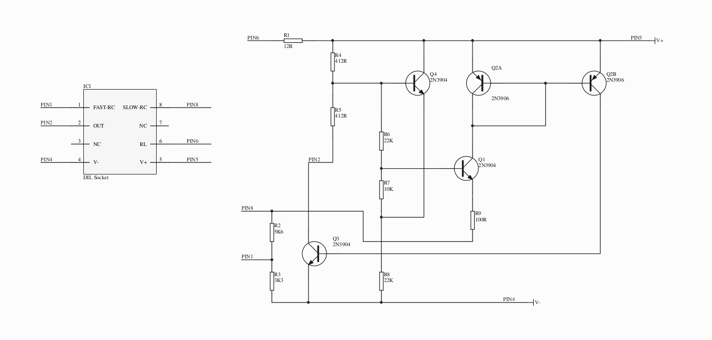
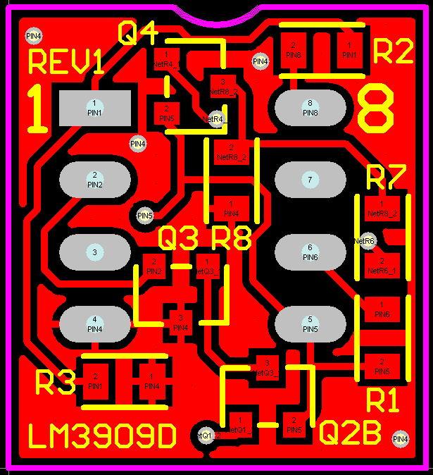
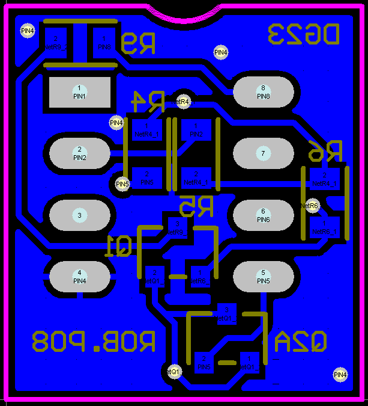

# ChipLM3909D
Popular LM3909 LED flasher reverse engineered as discrete components.  The LM3909N is no longer available and I used to play around with the device when I was a kid, bought from Tandy, UK.

The [reverse engineering](https://cdn.hackaday.io/files/291791248394336/Discrete%20Version%20Of%20The%20LM3909%20Oscillator%20IC.pdf) was done by Rob Paisley and is a few transistors and resistors.  Apparently it's a rather simple circuit even for 1971.  It includes a charge pump to take potential over that of the diode forward voltage driving the LED while running off a 1.5V cell for months.

The schematic was based upon Robs circuit.  A pdf is available [here](https://github.com/gigglerg/ChipLM3909D/lm3909d_schematic.pdf).  I tried to keep the DIP-8 footprint and expand on it with passives.

From the schematic I tried to keep everything as small as possible.  Its hard for me to manually solder below 0805 so that is what I stuck to during layout and to keep it small the parts are on both sides.

  
  

The [gerber files](https://github.com/gigglerg/ChipLM3909D/blob/master/CAMlm3909.zip) I used have been included.
